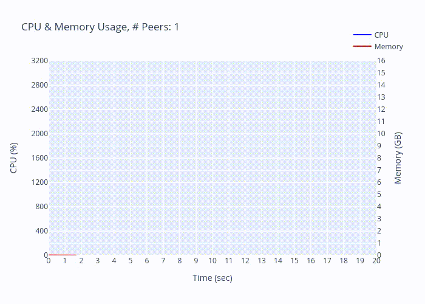
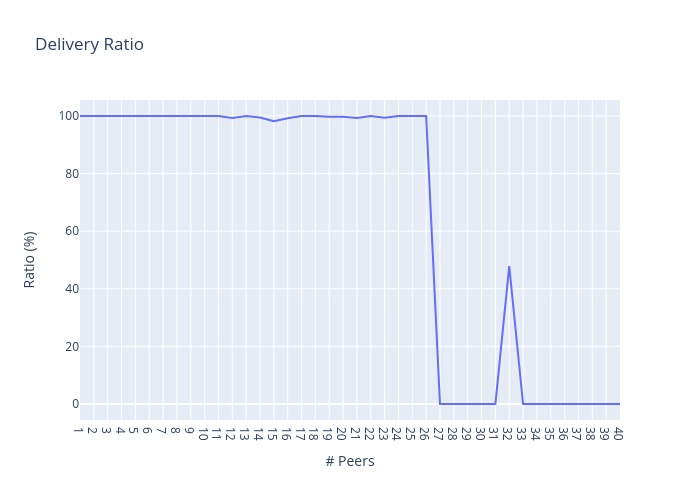

# Zenoh Peer-to-peer Benchmark

## Prerequisites

1. Build Rust source code for running the benchmark.

```
cargo build --release
```

2. Install Python dependencies for plotting the results.

```
pip3 install -r ./requirements.txt
```

## Usage

```
./run-benchmark.sh
```

The results will be stored at the directory `results`.

```
results
├── 1
│   ├── log.txt        <-- Full log of Rust exectuion
│   ├── result.json    <-- Experiment result, e.g. delivery_ratio, average_time
│   │                      Not presented if the exp failed on this setting
│   └── usage.txt      <-- CPU & memory usage
├── 10
│   ├── log.txt
│   ├── result.json
│   └── usage.txt
...
```

## Results Analysis

First, we need to The following results can be plotted by running

```
./plot.py --exp_dir results --output_dir pic     # save figures
./plot.py --exp_dir results                      # plot on browser
```

### Setting

* Machine
    * CPU: AMD Ryzen 9-5950X 3.4GH
    * Memory: 32 GB
* Packet size: 1 byte
* Number of peers: 1 ~ 40
* Timeout of each message: 10 seconds \
An exp would be marked as failed if exceeded the limit.
* Timeout of each P2P testing process: 20 seconds \
The process would be forcibly terminated if exceeded the limit.


### CPU & Memory Usage



### Delivery ratio of each peer



### Discussion

By observing the figures above, we found that

1. According to the occupation of memory, the Zenoh session cannot close itself even though the P2P communication has finished.
2. The program suddenly fails to send/receive messages if the number of peers exceeds 26.


## Acknowledgments

Thanks to the contributors

- [jerry73204](https://github.com/jerry73204)
- [Vincent Kuo](https://github.com/eurc17/)
